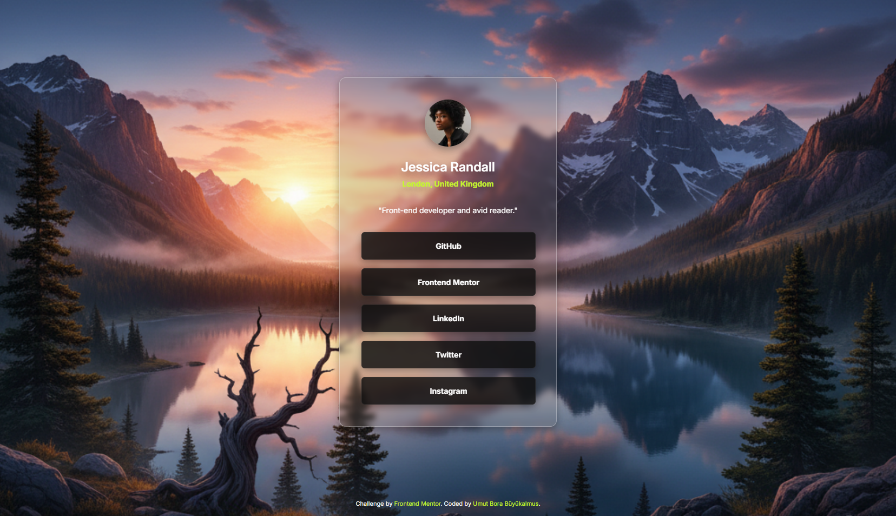

# Frontend Mentor - Social links profile solution with Glassmorphism

This is a solution to the [Social links profile challenge on Frontend Mentor](https://www.frontendmentor.io/challenges/social-links-profile-UG32l9m6dQ). This project has been customized to feature a **Glassmorphism (Glass Look)** effect, adding a modern flair to the design. Frontend Mentor challenges help you improve your coding skills by building realistic projects.

## Table of contents

- [Overview](#overview)
  - [The challenge](#the-challenge)
  - [Screenshot](#screenshot)
  - [Links](#links)
- [My process](#my-process)
  - [Built with](#built-with)
  - [What I learned](#what-i-learned)
  - [Useful resources](#useful-resources)
- [Author](#author)
- [Acknowledgments](#acknowledgments)

## Overview

### The challenge

Users should be able to:

- See hover and focus states for all interactive elements (social media links) on the page.
- Build a social link sharing card, similar to platforms like Linktree, staying as close as possible to the core Frontend Mentor design while adding a unique twist.

### Links

- [Solution URL (GitHub Repository)](https://github.com/UmutBoraBuyukalmus/social-links-profile-with-glassmorphism)
- [Live Site URL](https://umutborabuyukalmus.github.io/social-links-profile-with-glassmorphism/)

## My process

### Built with

- Semantic HTML5 markup
- CSS custom properties (`:root` variables)
- Flexbox (For card centering)
- Mobile-first workflow (`@media` query)

### What I learned

My main focus for this project was practicing the **Glassmorphism** effect in CSS. I applied this technique to the main card and the social media links by adjusting their background opacity and adding subtle borders and blur effects.

- **Glassmorphism Effect for the Card:**
```css
.card {
  background: rgba(120, 120, 120, 0.2);
  backdrop-filter: blur(5px);
  -webkit-backdrop-filter: blur(5px); /* For Safari support */
  border: 1px solid rgba(255, 255, 255, 0.3);
  box-shadow: rgba(0, 0, 0, 0.35) 0px 5px 15px;
  border-radius: 12px;
  /* ... other styles ... */
}
```
- Additionally, I used an AI-generated image (from Gemini) for the page's background to give the project a unique and vibrant look.

### Useful resources

[Glassmorphism CSS Generator](https://css.glass/) - A helpful tool for generating quick Glassmorphism starter code.

## Author

- Frontend Mentor - [@UmutBoraBuyukalmus](https://www.frontendmentor.io/profile/UmutBoraBuyukalmus)

## Acknowledgments

- Google Gemini for generating the unique background image for the project.
- Frontend Mentor for providing this foundational challenge.
